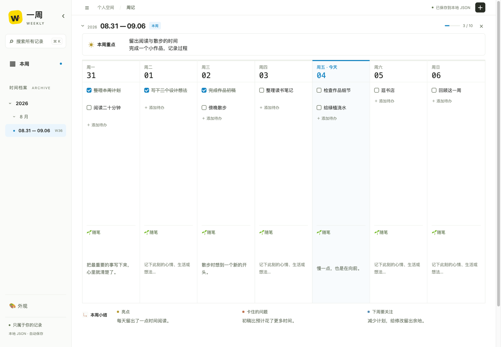

# 一周 · Weekly

**一屏一周，让计划和生活留在自己的文件里。**

一个本地优先的 Todo + 周记工具。七天横向排列，上下滚动翻周；网页用来查看和编辑，Agent 也可以直接维护同一份 JSON。

中文 · [English](README.en.md)



界面预览，内容均为虚构示例。

## 能做什么

- **按周记录**：本周重点、七天 Todo、每日 🌱 随笔，以及「亮点 / 卡住 / 下周」小结。
- **纵向翻周**：桌面上一屏主要展示完整一周，历史记录按需加载，左侧按年、月、周导航。
- **直接编辑**：行内修改、自动保存，搜索历史内容，快速勾选任务。
- **轻量外观**：Classic 与六套预设配色，今日高亮和极简 / 柔和模式。
- **数据自己掌握**：一周一个可读 JSON，既能手工编辑，也能交给具有本地文件读写能力的 Agent。

没有账号、云数据库或第三方运行依赖。界面目前为中文，主要面向桌面使用。

## 快速开始

需要 **Node.js 18 或更高版本**及现代浏览器（支持原生 Popover）。无需 `npm install`。

```bash
git clone https://github.com/LittleSunflower333/weekly-todo-journal.git
cd weekly-todo-journal
npm run setup
npm start
```

打开 [localhost:4173](http://localhost:4173)。终端按 `Control-C` 停止服务。端口被占用时可用 `PORT=4174 npm start`（macOS / Linux）。

首次启动是空白记录。点击右上角 `＋` 创建本周；已有记录时，`＋` 创建最新记录之后的一周。再次运行 `npm run setup` 不会覆盖已有数据。

## 日常使用

1. 在「本周重点」中每行写一项重点。
2. 在当天添加 Todo，按 Enter 或离开输入框确认；勾选即可完成。
3. 在 🌱 随笔中记录当天想留下的文字。
4. 周末填写「亮点 / 卡住 / 下周」，再创建下一周。

已有任务文字、重点、随笔和小结停止输入约 650ms 后保存；勾选和已确认的增删立即保存。离开前确认页面保存状态。历史周通过左侧时间导航、搜索或向下滚动查看，不会自动迁移未完成任务。

「🎨 外观」固定在左侧导航底部，收起导航后仍可用图标打开。偏好只保存在当前浏览器的 `weekly.theme`、`weekly.colorMode`、`weekly.todayHighlight` 中，不会写进周记 JSON。

## 让 Agent 帮你记录

仓库附带 [weekly-todo Skill](skills/weekly-todo/SKILL.md)，说明日期定位、数据结构、任务 ID、写入和校验规则。它操作本地 Weekly，不依赖 Notion，也不需要额外 AI API Key。你使用的 Agent 服务本身可能有费用与数据处理规则。

最简单的方式是让支持本地文件读写的 Agent 打开项目，并明确读取 Skill：

```text
项目在 /你的路径/weekly-todo-journal。
请先阅读 AGENTS.md 和 skills/weekly-todo/SKILL.md。
网页已保存并暂停编辑。请在今天添加「整理读书笔记」。
```

之后可以说：

- 「把今天的『整理读书笔记』标记完成。」
- 「给今天的随笔追加：傍晚散步时想到一个新点子。」
- 「根据本周记录拟一份周总结，先给我看。」
- 「把周五未完成的『整理照片』移到下周一。」

也可按所用 Agent 的 Skill 安装机制导入整个 `skills/weekly-todo` 文件夹。安装后仍需告诉 Agent 实际项目位置；仅克隆仓库不意味着所有 Agent 都会自动发现 Skill。

**网页与 Agent 请交替编辑。** 网页保存整周快照，目前没有并发冲突检测。交给 Agent 前完成网页保存并暂停编辑或关闭页面；Agent 修改完成后刷新，再继续在网页编辑。多标签页同时编辑也有覆盖风险。

## 数据与备份

```text
data/
├── index.json                 # { "weeks": [{ "startDate", "endDate" }] }
└── weeks/
    └── 2026-08-31.json         # 周一日期命名，一周一个文件
```

周文件包含 `startDate`、`endDate`、`focus`、七项 `days` 和 `summary`。每一天有 `date`、`tasks`、`note`；任务有稳定的 `id`、`text`、`done`。完整约束见 [Skill 数据说明](skills/weekly-todo/SKILL.md#data-contract)。

`data/` 已被 Git 忽略，**推送代码不会备份周记**。单独复制整个目录作为备份；恢复时先停止服务并关闭编辑页面，再恢复目录。手工或 Agent 编辑后运行 `npm run check`，刷新网页读取最新内容。

服务默认只监听本机 `127.0.0.1`，没有登录鉴权；当前版本用于本地个人使用。将代码公开到 GitHub 不会把应用变成在线服务。请勿直接把数据接口暴露到公网。

## 开发与反馈

原生 HTML / CSS / JavaScript + Node.js 内置 HTTP 与文件模块。没有构建步骤。

```bash
npm run check   # 校验本地索引及其引用的周文件
npm test        # 在临时目录测试存储与校验，不使用个人周记
```

欢迎通过 [Issues](https://github.com/LittleSunflower333/weekly-todo-journal/issues) 反馈问题或提出小而明确的改进。请附复现步骤、浏览器 / Node.js 版本，并使用虚构示例替代私人记录。项目希望保持本地优先、JSON 可读与一屏一周的简单结构。

如果它对你有帮助，欢迎点一个 Star。

## 许可证

[MIT](LICENSE) · Copyright © 2026 LittleSunflower333
